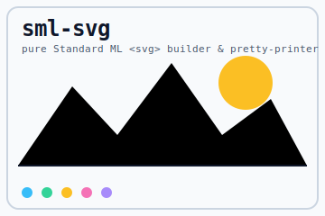

# sml-svg

[](https://github.com/sjqtentacles/sml-svg/actions/workflows/ci.yml)

A pure Standard ML **SVG document builder and pretty-printed serializer**.
Describe a drawing as a tree of `el` values (`Rect`, `Circle`, `Line`, `Path`,
`Group`, `Text`) and `Svg.toString` renders a complete, indented `<svg>`
document. Layout is delegated to the vendored
[`sml-pretty`](https://github.com/sjqtentacles/sml-pretty) printer (one element
per line, group children indented two columns). No FFI, no external
dependencies, and **deterministic** — byte-identical under both
[MLton](http://mlton.org/) and [Poly/ML](https://www.polyml.org/).



*(the image above is [`example.svg`](example.svg), produced verbatim by
`make example`)*

## Status

- 25 assertions, green on MLton and Poly/ML.
- Basis-library only; deterministic across compilers.
- Vendors `sml-pretty` (Layout B), so the repo builds standalone.

## Install

With [`smlpkg`](https://github.com/diku-dk/smlpkg):

```
smlpkg add github.com/sjqtentacles/sml-svg
smlpkg sync
```

Include the MLB from your own (it pulls in the vendored `sml-pretty`):

```
local
  $(SML_LIB)/basis/basis.mlb
  lib/github.com/sjqtentacles/sml-svg/... (via smlpkg)
in
  ...
end
```

This brings `structure Svg` (and the vendored `Pretty`) into scope.

## Quick start

```sml
val doc =
  { width = 200, height = 100
  , els =
      [ Svg.Rect { x = 10.0, y = 20.0, width = 50.0, height = 30.0
                 , attrs = [("fill", "red")] }
      , Svg.Group
          [ Svg.Circle { cx = 120.0, cy = 50.0, r = 25.0
                       , attrs = [("fill", "blue")] }
          , Svg.Text { x = 60.0, y = 90.0, text = "a < b & c"
                     , attrs = [("font-size", "12")] } ] ] }

val () = print (Svg.toString doc)
```

renders (note the XML-escaped text and the indented group):

```svg
<svg xmlns="http://www.w3.org/2000/svg" width="200" height="100" viewBox="0 0 200 100">
  <rect x="10.0" y="20.0" width="50.0" height="30.0" fill="red"/>
  <g>
    <circle cx="120.0" cy="50.0" r="25.0" fill="blue"/>
    <text x="60.0" y="90.0" font-size="12">a &lt; b &amp; c</text>
  </g>
</svg>
```

## API (`signature SVG`)

```sml
type attr = string * string

datatype el =
    Rect   of { x:real, y:real, width:real, height:real, attrs:attr list }
  | Circle of { cx:real, cy:real, r:real, attrs:attr list }
  | Line   of { x1:real, y1:real, x2:real, y2:real, attrs:attr list }
  | Path   of string
  | Group  of el list
  | Text   of { x:real, y:real, text:string, attrs:attr list }

val toString : { width:int, height:int, els:el list } -> string
val fmtReal  : real -> string
```

- **Coordinates are `real`** and are rendered by `fmtReal`. Shapes
  (`Rect`/`Circle`/`Line`/`Text`) carry a free-form `attrs` list of
  `(name, value)` pairs emitted (escaped) after the geometry, so styling such
  as `("fill", "red")`, `("stroke", "#0f172a")`, or `("rx", "12")` needs no
  dedicated constructor.
- **`Path`** is raw path data (`d`); **`Group`** wraps a `<g>`.
- `toString` produces a full document with `xmlns`, `width`, `height`, and a
  matching `viewBox`, and has **no trailing newline**.

### Deterministic numbers (`fmtReal`)

Cross-compiler reproducibility hinges on real formatting. `fmtReal` uses a
fixed precision (so no scientific notation, no `GEN`-format differences between
compilers), trims trailing zeros but always keeps a decimal point, and uses a
leading `-` rather than SML's `~`:

```sml
Svg.fmtReal 10.0   = "10.0"
Svg.fmtReal 3.14   = "3.14"
Svg.fmtReal ~2.5   = "-2.5"
Svg.fmtReal 0.0    = "0.0"
Svg.fmtReal 1.125  = "1.125"
```

### Escaping

Attribute values escape `& < > "`; text content escapes `& < >`. So
`Text { text = "a < b & c", ... }` becomes `a &lt; b &amp; c` and an attribute
value `a"&<>b` becomes `a&quot;&amp;&lt;&gt;b`.

## Build & test

```
make test        # MLton
make test-poly   # Poly/ML
make all-tests   # both
make example     # build + run examples/demo.sml (writes example.svg)
make clean
```

Both compilers run the same strict-TDD suite (`test/test.sml`), which checks
SVG output **byte-for-byte** against golden documents (exact serialization is
the contract here, so every assertion is a `checkString`). Highlights:

- **Numeric formatting:** `fmtReal` over whole/fractional/negative/zero values.
- **Shapes:** `rect`/`circle`/`line`/`path`/`text` with and without `attrs`.
- **Escaping:** XML-escaped text content and attribute values.
- **Layout:** one element per line; nested `Group`s indent two columns each;
  empty documents and empty groups stay tidy (no trailing whitespace).

### Poly/ML note

CI builds Poly/ML 5.9.1 from source rather than using the Ubuntu package
(Poly/ML 5.7.1), whose X86 code generator crashes (`asGenReg raised while
compiling`) on heavy real-arithmetic code. See `.github/workflows/ci.yml`.

## License

MIT — see [LICENSE](LICENSE).
